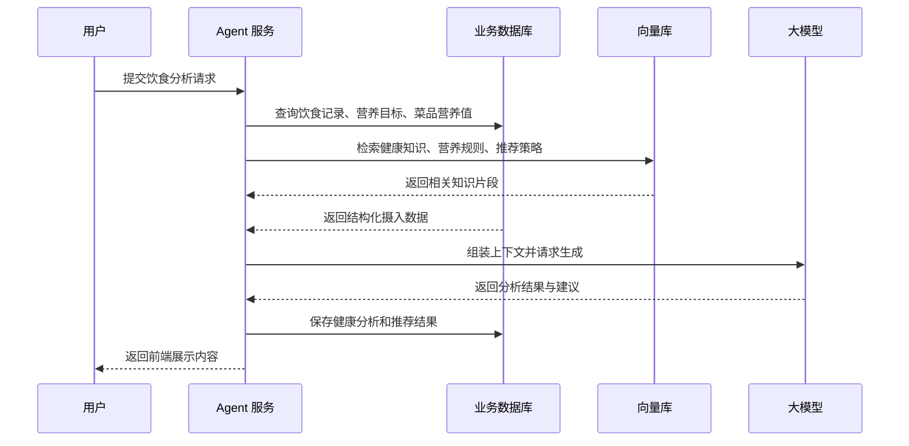

# Agent 工作流程与 RAG 方案

## 1. 目标

本方案面向“外卖点餐 + 健康饮食分析”场景，目标是把系统拆成两层：

1. 业务数据层：负责存储用户、菜品、套餐、订单、饮食记录、营养标签、健康分析结果等结构化数据。
2. 智能决策层：负责调用大模型与 RAG，对用户饮食做分析、解释和推荐。

核心原则是：

1. 结构化数据走数据库，不要放进纯文本。
2. 规则知识、营养知识、健康建议走 RAG。
3. 大模型负责推理、总结和生成自然语言结果。

## 2. Agent 总体工作流

### 2.1 主流程

1. 用户产生输入。
2. 系统识别输入类型。
3. 如果是交易类操作，走外卖业务流程。
4. 如果是健康分析类操作，走饮食分析流程。
5. 健康分析流程中，先查数据库，再做 RAG 检索，最后调用模型生成结果。
6. 把分析结果和推荐结果落库，供前端展示和历史追踪。

### 2.2 详细步骤

1. 数据采集。
2. 数据标准化。
3. 营养计算。
4. 知识检索。
5. 模型推理。
6. 结果入库。
7. 前端展示。
8. 用户反馈和迭代。

## 3. 健康饮食 Agent 的业务链路

### 3.1 输入来源

健康饮食 Agent 的输入可以来自以下几种渠道：

1. 用户手动添加饮食记录。
2. 用户下单后自动同步订单明细。
3. 图片识别或文本识别得到的食物信息。
4. 用户填写的饮食目标，比如减脂、增肌、控糖。

### 3.2 数据读取顺序

Agent 处理一次分析时，建议按下面顺序读取数据：

1. 先读取用户营养目标。
2. 再读取当天或最近一段时间的饮食记录。
3. 再读取菜品营养成分表。
4. 再读取菜品营养标签和食材信息。
5. 最后再进入 RAG 检索补充外部知识。

### 3.3 处理流程

1. 从 diet_record 和 diet_record_item 汇总用户摄入。
2. 从 dish_nutrition_profile 计算热量、蛋白质、脂肪、碳水、钠等总量。
3. 从 dish_nutrition_tag 判断菜品是否属于高蛋白、低脂、低碳水等类别。
4. 从 nutrition_goal 判断用户当前目标。
5. 从 RAG 检索健康知识、膳食建议和推荐策略。
6. 交给大模型生成分析结论、风险提示和饮食建议。
7. 将结果写入 health_analysis 和 health_recommendation。

## 4. RAG 在这里做什么

RAG 的作用不是替代数据库，而是补足模型的知识面。

### 4.1 适合用 RAG 的内容

1. 营养学知识，例如蛋白质、脂肪、碳水、膳食纤维的作用。
2. 健康饮食规则，例如控糖、控盐、减脂、增肌建议。
3. 特殊人群建议，例如高血压、糖尿病、减脂期、健身人群。
4. 食材解释，例如鸡蛋、豆腐、牛肉、鱼类、蔬菜的营养特点。
5. 推荐话术模板，例如如何向用户解释“为什么推荐这道菜”。

### 4.2 不适合用 RAG 的内容

1. 用户每天吃了什么。
2. 某道菜的热量和三大营养素数值。
3. 某个用户的历史记录。
4. 某条推荐结果和某次分析结果。

这些内容应该直接存数据库并按需查询，不要交给向量检索来猜。

## 5. RAG 接入方式

### 5.1 推荐架构

建议采用“数据库 + 向量库 + 大模型”的混合架构：

1. 数据库负责业务事实。
2. 向量库负责知识检索。
3. 大模型负责生成最终回复。

### 5.2 典型流程

## 6. 需要补充的组件

如果要把这套 Agent 真正做出来，除了数据库，还需要下面这些东西。

### 6.1 必要组件

1. 大模型接口。
2. Embedding 模型，用于把知识切片转成向量。
3. 向量数据库，用于存储和检索知识片段。
4. 文档切分器，用于把长文档切成适合检索的小块。
5. 重排序模型，可选，但推荐，用于提升检索结果质量。
6. Agent 编排层，用于组织“查库、检索、生成、落库”的流程。
7. 任务调度器，用于定时更新饮食分析和推荐结果。
8. 日志和监控，用于追踪 Agent 的输入、输出和失败原因。

### 6.2 推荐组件选型

1. 向量库可以选 Milvus、FAISS、pgvector、Chroma 之一。
2. Embedding 模型可以选通用中文向量模型。
3. 大模型可以选支持工具调用和长上下文的模型。
4. 后端可以用 Python 或 Java 实现 Agent 服务。

### 6.3 辅助组件

1. 对象存储，用于保存菜品图片、文档原文和导入资料。
2. 缓存，用于缓存热门推荐和常用知识片段。
3. 权限系统，用于区分用户、商家和管理员。
4. 反馈系统，用于记录用户对推荐和分析结果的满意度。

## 7. 知识库应该放什么

RAG 的知识库建议分成几类：

1. 营养基础知识库。
2. 人群饮食建议库。
3. 食材知识库。
4. 菜品解释知识库。
5. 推荐策略知识库。
6. 系统规则知识库。

每个知识片段最好包含这些信息：

1. 标题。
2. 内容正文。
3. 来源。
4. 标签。
5. 适用人群。
6. 更新时间。

## 8. 和当前数据库设计的关系

当前数据库设计已经能承担这些事实数据：

1. 用户是谁。
2. 吃了什么。
3. 菜品有什么营养成分。
4. 菜品有哪些健康标签。
5. 系统给出了什么分析结果。
6. 系统推荐了什么。

RAG 应该补的是“为什么这样建议”和“这些建议背后的知识依据”。

所以最合适的分工是：

1. 数据库存事实。
2. RAG 存知识。
3. 大模型做推理和生成。

## 9. 什么时候必须用 RAG

以下场景很适合或几乎必须用 RAG：

1. 你要解释推荐原因，而不是只给出推荐列表。
2. 你要支持多种健康饮食规范并持续更新。
3. 你要根据不同用户人群给出不同建议。
4. 你要把商家说明、菜品介绍、健康规则一起综合分析。

## 10. 什么时候可以先不用 RAG

以下场景可以先不用 RAG：

1. 只做固定规则的健康评分。
2. 只做简单的营养汇总和阈值判断。
3. 只输出结构化报表，不要求自然语言解释。

如果早期目标只是验证功能，先做数据库 + 规则引擎也可以，后续再接 RAG。

## 11. 实施建议

建议按三个阶段推进：

1. 第一阶段：先把数据库和健康标签体系做完整，保证数据可算。
2. 第二阶段：加规则引擎和基础分析，保证结果稳定。
3. 第三阶段：接入 RAG 和大模型，提升解释能力和推荐质量。

这样做的好处是风险更低，能先跑通闭环，再逐步提高智能化程度。